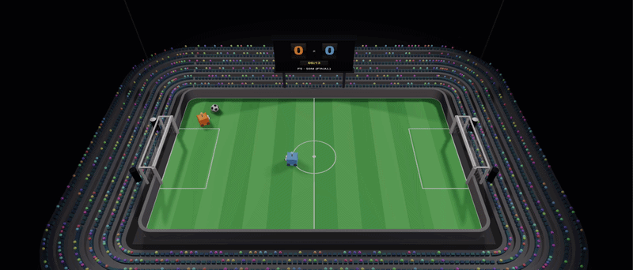
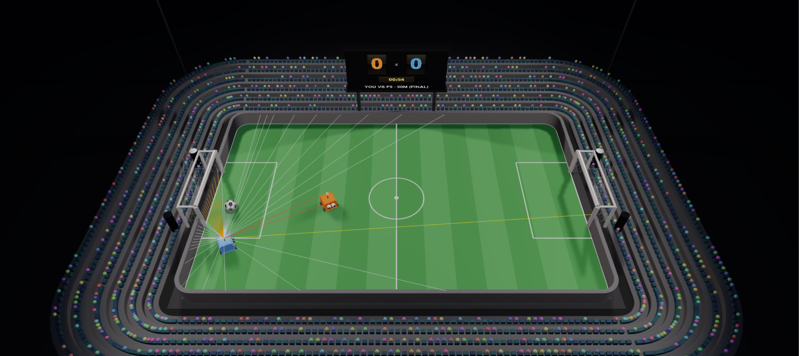
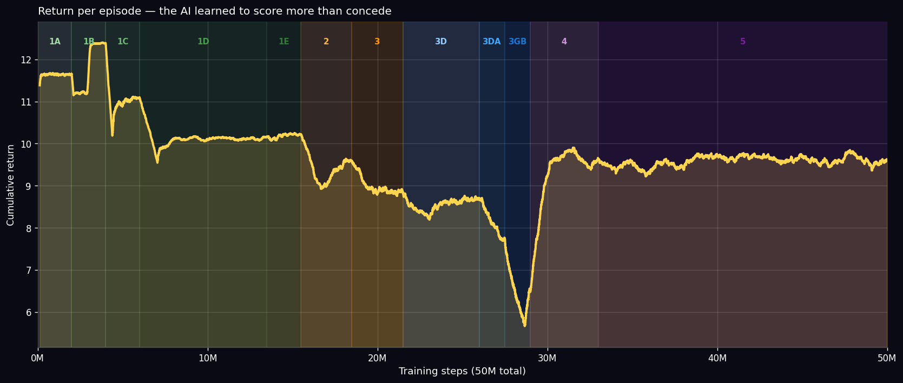
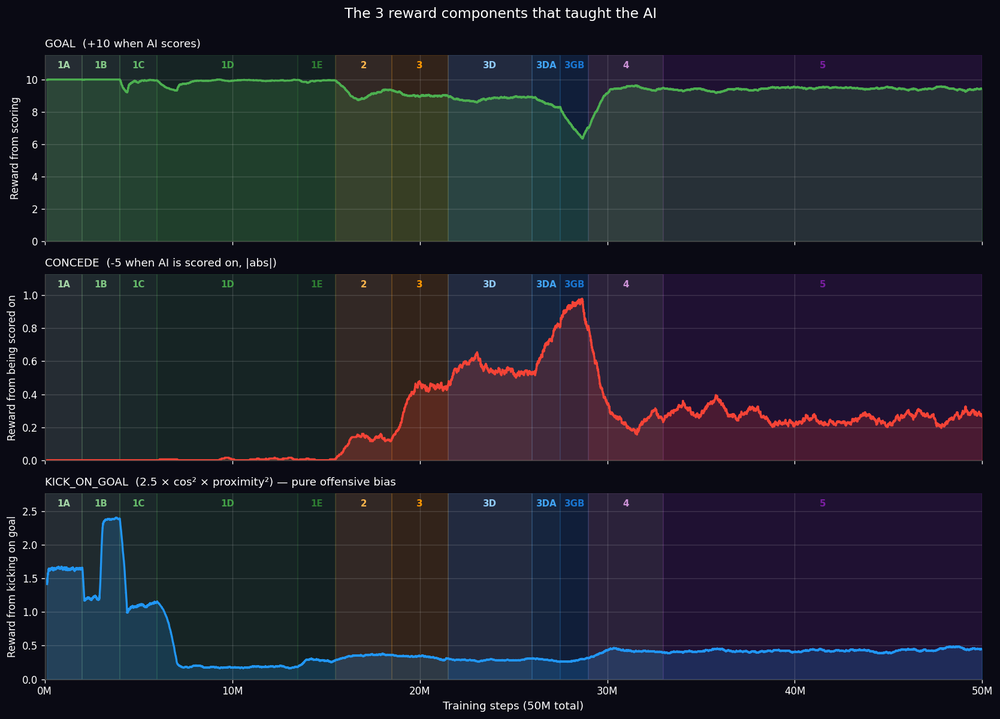
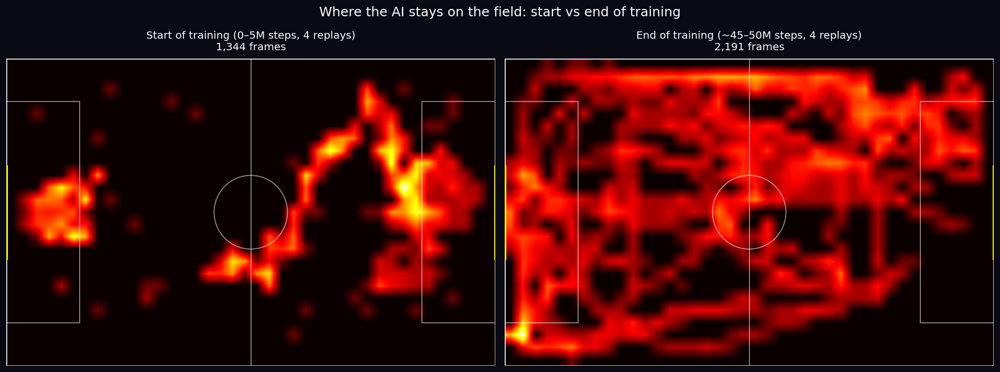
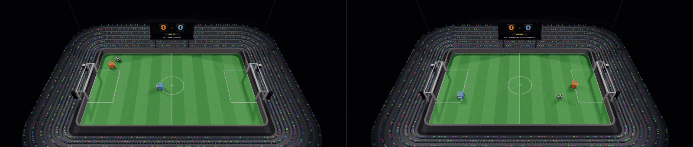

# AI Football

> A 1v1 football AI trained for ~1 billion cumulative steps with PPO. Plays live in your browser.

<p align="center">
  <a href="https://henriquetargino.github.io/ai_football/">
    
  </a>
  &nbsp;
  <a href="#">
    
  </a>
</p>

---



*V10.2 in a 1v1 self-play match. 50 million training steps. ~6 hours of compute. No human guidance — just PPO, a reward function, and a curriculum.*

---

## What is this?

Two robots on a 2D physics field, rendered in 3D in the browser. A neural network — trained with PPO over three months across three rewrites and several catastrophic failures — controls one of them. The other is either another snapshot of the same network, a scripted baseline, or you.

The whole thing runs entirely client-side: the trained model is ~600 KB of JSON, and inference happens in pure JavaScript at 60 fps. There's no server.

**V10.2** is the model in production: 50M training steps, fresh run (not fine-tuned), 12-phase curriculum, ~6 hours on a 13" MacBook Air M4. The article in the link above is the postmortem of the failures that came before it.

---

## How the AI sees the world



The agent doesn't see pixels. It sees the world through **48 raycasts** fanned out from its body. Each ray reports `(normalized distance, what-it-hit)` where *what* is one of: wall, ball, ally, enemy, own goal, enemy goal. The image above shows what one frame of this looks like — colored rays representing the agent's entire field of perception.

The raycasts plus the agent's own state (speed, angular velocity, can-kick flag, ball-visible-anywhere flag, action-repeat index) become a **341-dimensional input**.

The network is a small MLP — **341 → 64 → 64 → 18** — about 27,000 parameters total. Output is 18 discrete actions: every combination of `(accelerate / brake / coast) × (turn left / straight / turn right) × (kick / don't)`.


*The network making decisions in real time. Press `N` during the demo to open this panel yourself — it's bucketed (avg-pooled) so the 341 inputs fit on screen.*

---

## How it learns

12-phase curriculum that drills specific skills in order, with an anti-forgetting rotation that keeps the agent practicing earlier skills 20% of the time even after advancing.

| Phase | What it teaches | % of training |
|-------|-----------------|---------------|
| 1A–1C | Chase a static / aligned / small-angle ball | 12% |
| 1D | Lateral ball — agent must rotate to align | 15% |
| 1E | Diagonal ball — covers the in-between cases | 4% |
| 2 | Passive opponent — generalize attack | 6% |
| 3 | Scripted opponent — first real competition | 6% |
| 3D | Defensive spawns | 9% |
| 3DA | Active defense — opponent advancing | 3% |
| 3GB | Goal-line block — agent inside the goal | 3% |
| 4 | Random spawns anywhere on the field | 8% |
| 5 | Self-play vs past versions | 34% |

Each fix for one failure mode produced the opposite failure mode. The article goes deep on the three most useful ones: the *Pacifist Trap*, the *Curriculum Two-Sided Trade-off*, and the *NaN crash from continuous actions*.

---

## Training results



The agent's cumulative return per episode across 50M steps. The valley around 28M is the goalkeeper-bias phase (3GB) — the agent is *unlearning* part of the attack policy to make room for goalkeeping behavior. Reinforcement learning networks don't add skills like layers in a stack; they overwrite each other in the same shared weights.

---



The three components of the reward function, plotted separately: **GOAL** (+10 when the AI scores), **CONCEDE** (-5 when scored on, plotted as absolute value), and **KICK_ON_GOAL** (a continuous bonus for kicks aimed at the goal, decaying quadratically with distance). Each component rises in the phase where it matters most.

---



Where the agent spends its time on the field. **Left:** the first 5M steps. **Right:** the last 5M steps. Same agent, same architecture, same observation. The difference is fifty million training steps.

---

## After vs Before



**Left:** V10.2 after 50M training steps — playing actual football, going to the ball, finishing on goal. **Right:** the same network at step 0, before any learning — random actions, drifting, occasional accidental kicks. Same architecture, same observation, same reward function. Everything in between is what the article is about.

---

## The 3 modes

| Mode | What you do |
|------|-------------|
| **Watch the Replay** | Pick a checkpoint from V10.2's training (F0 random → F5 50M final) and watch a 40-second self-play replay. |
| **Take on the AI** | Play against a snapshot of the AI. `WASD` to move, `Space` to kick. |
| **AI vs AI** | Two snapshots of the AI play live in your browser. Pure JS inference, no server. |

In-game shortcuts: `R` toggles raycasts, `N` opens the neural network panel, `ESC` returns to the menu.

---

## Tech stack

- **Backend (training)** — Python · PyTorch · custom PPO loop (CleanRL-style) · Gymnasium · TensorBoard
- **Frontend** — Vanilla JavaScript · Three.js · no build step
- **Inference** — Pure JavaScript port of the PyTorch forward pass (bit-for-bit parity, verified with parity tests)
- **Hosting** — GitHub Pages with auto-deploy via GitHub Actions on push

---

## Setup & training (brief)

If you want to retrain or run locally, here's the short version. The full project is set up for a Mac M-series laptop without a GPU.

**Backend** (Python 3.11+):
```bash
pip install -r requirements.txt
python -m backend.ai.train --smoke-test 10    # V10.2 config (50M steps, ~6h)
```

**Frontend** (no install needed for playing — already deployed to Pages):
```bash
python3 -m http.server 8080 --directory frontend
# open http://localhost:8080
```

**Publish a trained run to the frontend:**
```bash
python -m backend.ai.publish_run --run-dir data/runs/<RUN_ID>
```

**Tests:**
```bash
pytest backend/ai/tests/      # backend (~150 tests)
cd frontend && npm test       # frontend Python ↔ JS parity (~27 tests)
```

Curriculum stages and hyperparameters are in `backend/ai/train.py`. Physics constants in `backend/config.py` (must stay in sync with `frontend/src/game/physics.js` — see the parity tests).

---

## License

Personal portfolio project. No explicit license — copyright reserved to the author (Henrique Targino).
